# Демоснтрация работы графического интерфейса приложения

## Основной экран регистрации пациента

### Взрослого мужчины

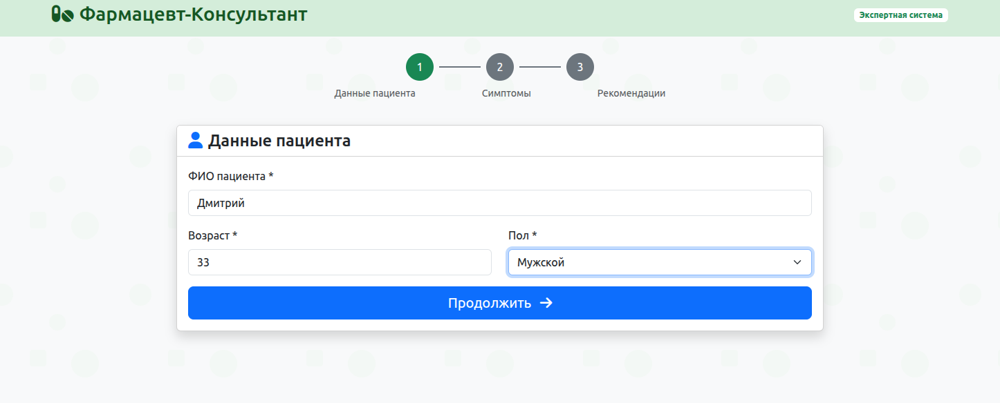

### Беременной женщины

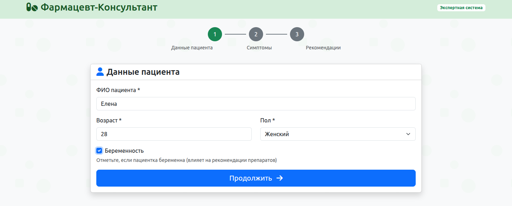

### Ребёнка

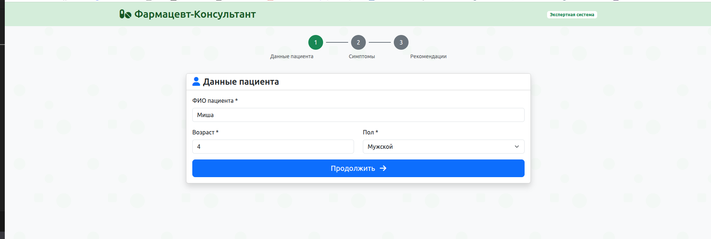

## Экран выбора симптомов

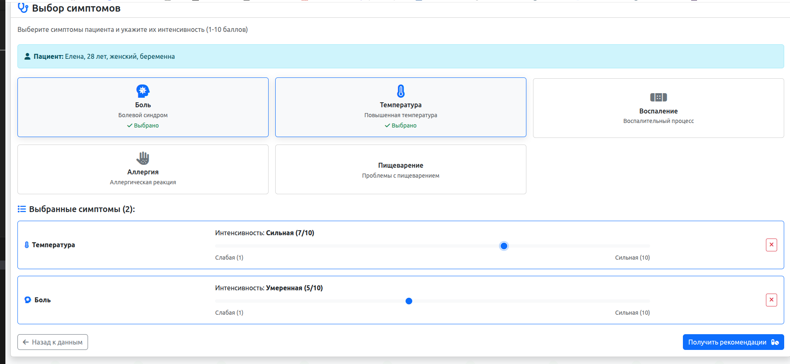

## Рекоммендации

### Рекоммендации для Взрослого мужчины

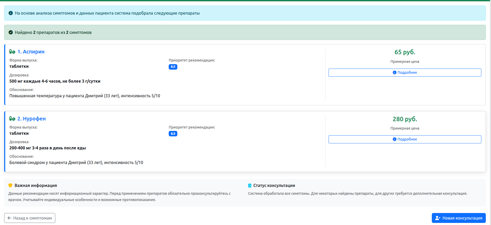

### Рекоммендации для Женщины

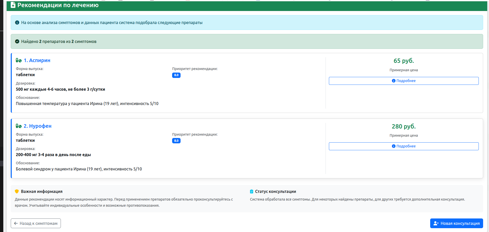

### Рекоммендации для Беременной женщины

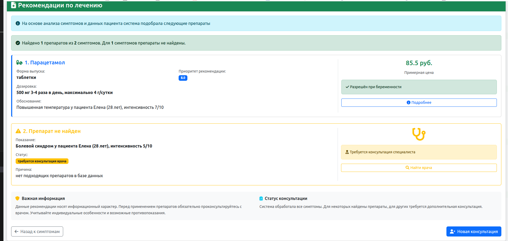

### Рекоммендации для Ребёнка

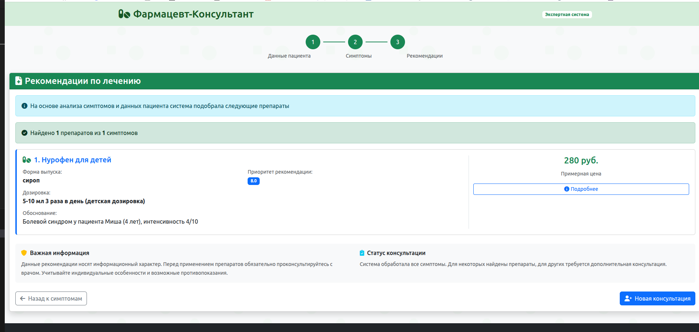

## Несколько рекоммендаций

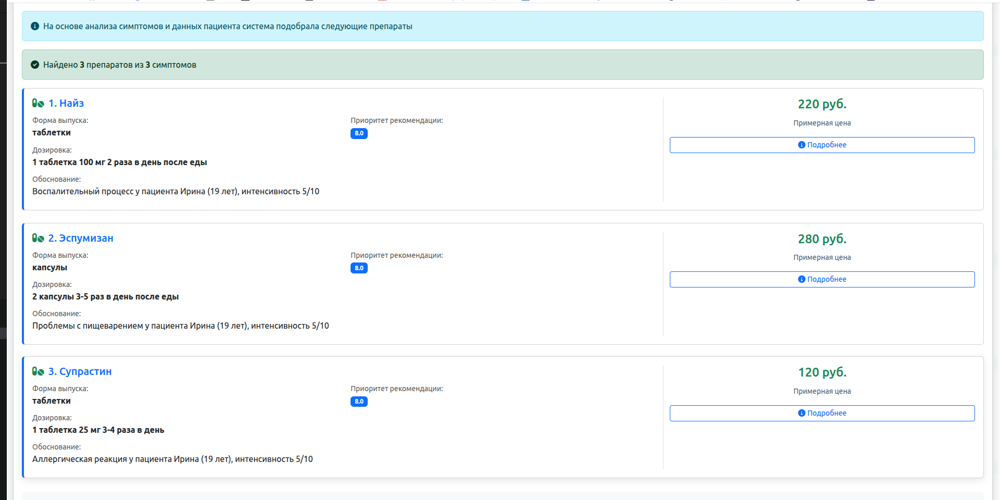

### Если нет рекоммендаций

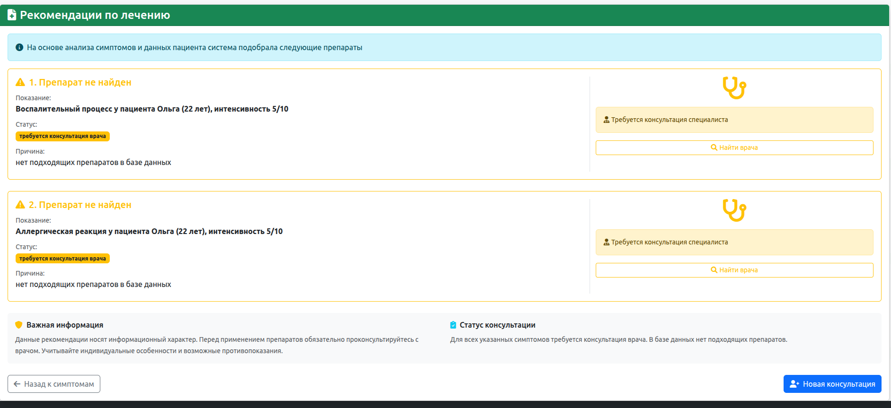

## Пример ответа сервера CLIPS

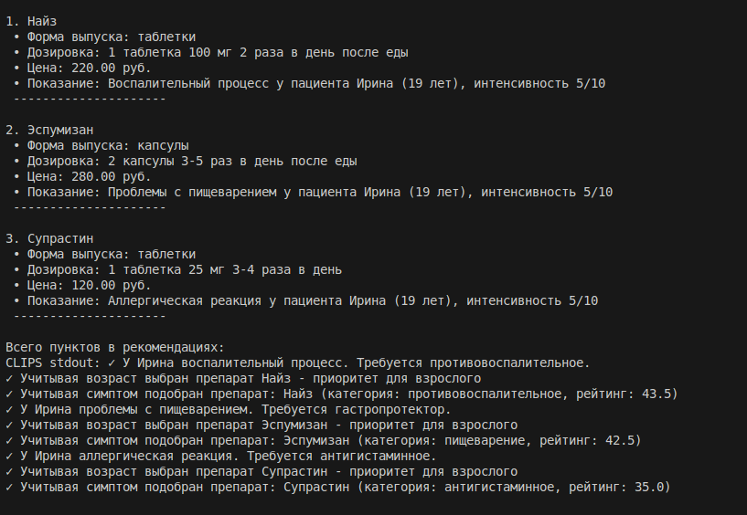
