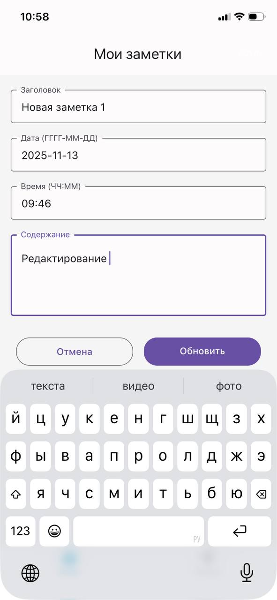
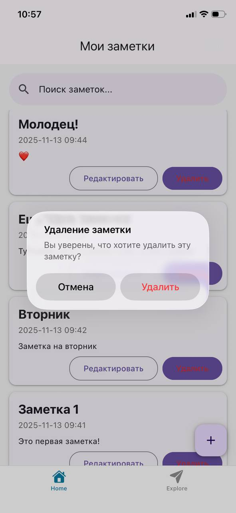
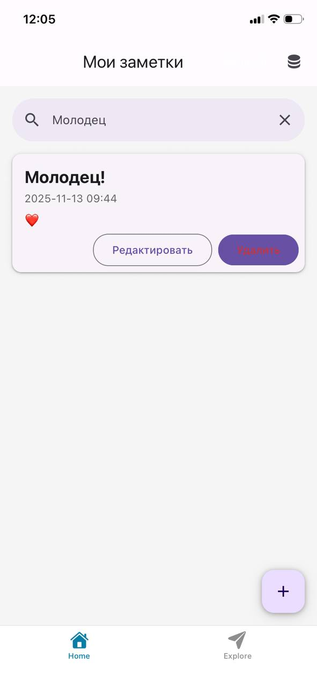
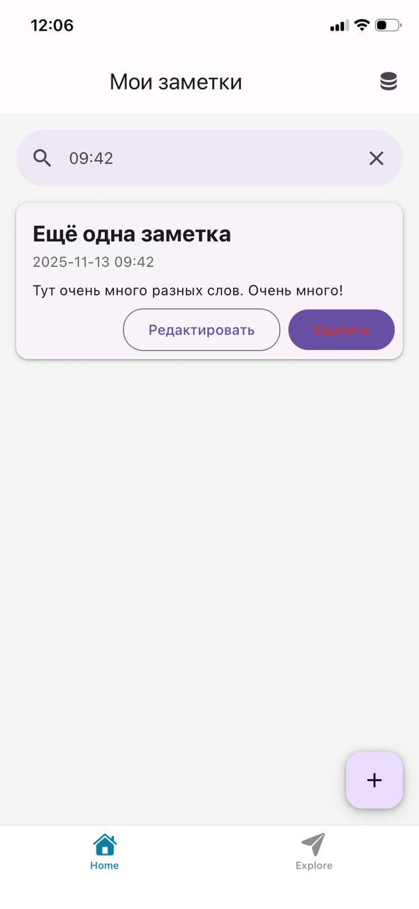
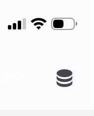
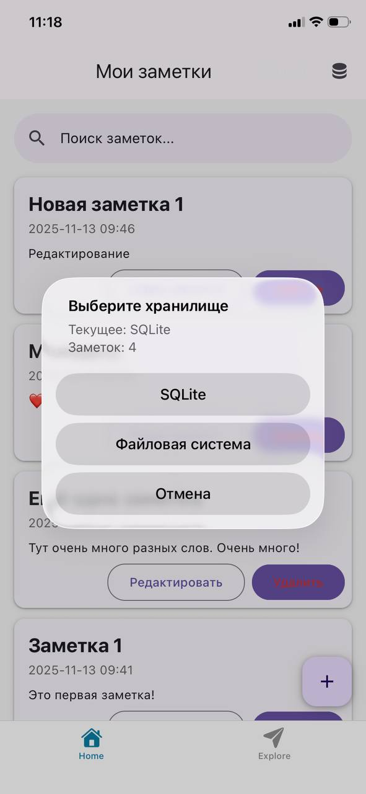

# Кейс-задача № 4

Необходимо разработать мобильное приложение с графическим пользовательским
интерфейсом, которое будет поддерживать создание, редактирование, удаление и поиск
заметок в рамках работы любой организации. Приложение должно обеспечивать
удобство ведения записей во время различных мероприятий, таких как совещания,
собрания, конференции и другие деловые встречи.
Основные функции приложения:
1 Создание заметки – возможность создания новой записи с указанием заголовка,
даты, времени и содержания.
2 Редактирование заметки – возможность изменения существующей записи.
3 Удаление заметки – возможность удаления ненужных записей.
4 Поиск заметки – функция поиска, по ключевым словам, дате, времени или другим
параметрам.

Варианты хранения данных:
Приложение должно предусматривать два способа хранения заметок:

- В базе данных SQLite (локальное хранение).
- С использованием файловой системы устройства (например, сохранение заметок в
виде файлов).

Дополнительные требования:

- Приложение должно иметь интуитивный интерфейс, который позволит
пользователям легко ориентироваться и выполнять необходимые операции без
длительного обучения.
- Поддержка разных платформ (iOS, Android) приветствуется.
- Возможность синхронизации данных между устройствами через облачные сервисы
может быть рассмотрена как дополнительная функциональность.

Ответом к решению кейс-задачи станет руководство с иллюстрациями о том, как правильно
пользоваться приложением, а также описание его функциональных возможностей.
Дополнительно предоставьте ссылку на приложение удобным для вас способом вместе с
пояснением для научного руководителя практики о том, каким образом можно протестировать
данное приложение.

## Ответ

## Руководство по приложению "Мои заметки"

## Обзор приложения

**"Мои заметки"** - это кроссплатформенное мобильное приложение для ведения записей во время деловых мероприятий (совещания, собрания, конференции).

### Основные функции

| Функция | Реализация |
|---------|------------|
| **1. Создание заметки** | Форма с заголовком, датой, временем и содержанием |
| **2. Редактирование заметки** | Кнопка "Редактировать" в каждой заметке |
| **3. Удаление заметки** | Кнопка "Удалить" с подтверждением |
| **4. Поиск заметки** | Поиск по заголовку, содержанию, дате, времени |

### Системы хранения

| Хранилище | Реализация |
|-----------|------------|
| **SQLite** | Локальная база данных |
| **Файловая система** | JSON файлы |

### Дополнительные требования

| Требование | Реализация |
|------------|------------|
| **Интуитивный интерфейс** | Material Design, понятная навигация |
| **Кроссплатформенность** | React Native + Expo (iOS/Android) |

---

## Функциональные возможности

### Основные возможности

- **Создание заметок** с ограничениями длины (заголовок: 100 символов, содержание: 2000 символов)
- **Полноэкранный просмотр** длинных заметок с прокруткой
- **Автосохранение** данных при перезапуске приложения

### Технические особенности

- **Архитектура**: React Native + Expo + TypeScript
- **Навигация**: Expo Router (file-based routing)
- **UI**: React Native Paper (Material Design)
- **Хранение**: SQLite + FileSystem API
- **Поиск**: Full-text search по всем полям

---

## Руководство пользователя

### 1. Главный экран ("Все заметки")

- **Список заметок** в хронологическом порядке
- **Поисковая строка** вверху
- **Кнопка переключения хранилища** 🗄️ (SQLite/Файлы)
- **Кнопка создания** ➕ в правом нижнем углу

### 2. Создание заметки

- Нажмите кнопку ➕
- Заполните поля:
  - **Заголовок** (до 100 символов)
  - **Дата** в формате ГГГГ-ММ-ДД
  - **Время** в формате ЧЧ:ММ  
  - **Содержание** (до 2000 символов)
- Нажмите "Создать"


### 3. Просмотр заметки

- Нажмите на любую заметку в списке
- Для возврата - тап на стрелку в верхнем левом углу


### 4. Редактирование заметки

- Нажмите "Редактировать" на нужной заметке
- Внесите изменения в форму
- Нажмите "Обновить"



### 5. Удаление заметки

- Нажмите "Удалить" на нужной заметке
- Подтвердите действие во всплывающем окне



### 6. Поиск заметок

- Введите текст в поисковую строку
- Поиск работает по:
  - Заголовку
  - Содержанию
  - Дате
  - Времени
- Для отмены - очистите строку поиска




### 7. Переключение хранилищ

- Нажмите иконку со знаком "Базы дфнных" в правом верхнем углу
- Выберите:
  - **SQLite** - база данных  
  - **Файловая система** - JSON файлы  
- Каждое хранилище содержит свои данные (не синхронизируются)




---

### Ссылка на репозиторий

**GitHub:** `[https://github.com/Eddie55d/practice_2025/tree/master/task_03]`

### Инструкция по запуску

```sh
# 1. Клонирование репозитория
git clone [repository-url]
cd NotesApp

# 2. Установка зависимостей
npm install

# 3. Запуск проекта
npx expo start

# 4. Тестирование на устройстве
- Установить Expo Go на телефон
- Отсканировать QR-код из терминала
```

### Поддерживаемые платформы

- **Android**  
- **iOS**  
- **Web** (если отключить функционал SQLite, т.к. формат некоторых файлов SQLite не поддерживается браузерами)

---
