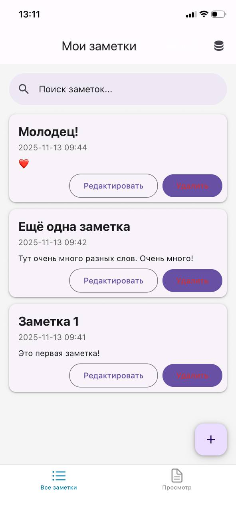
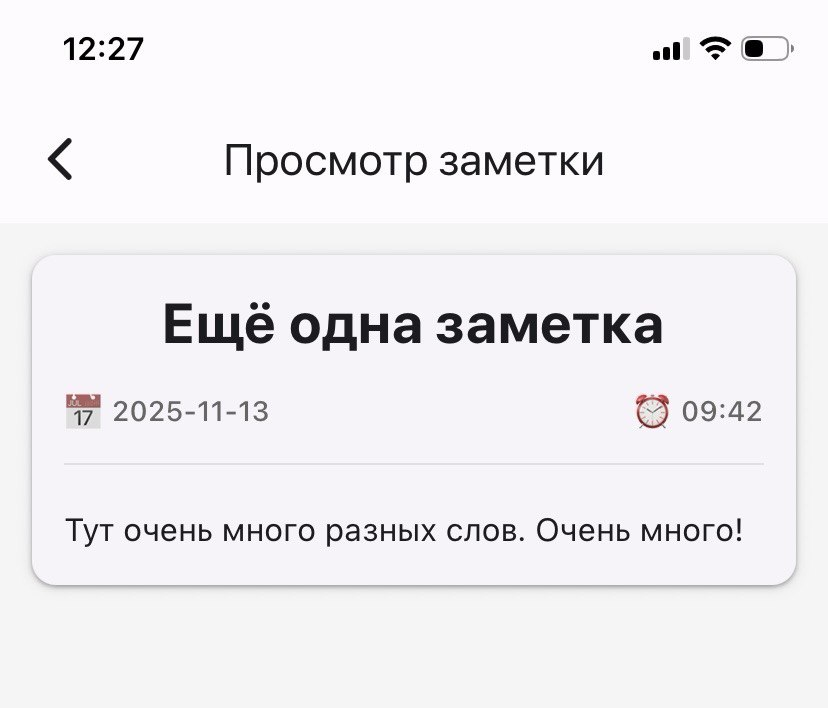
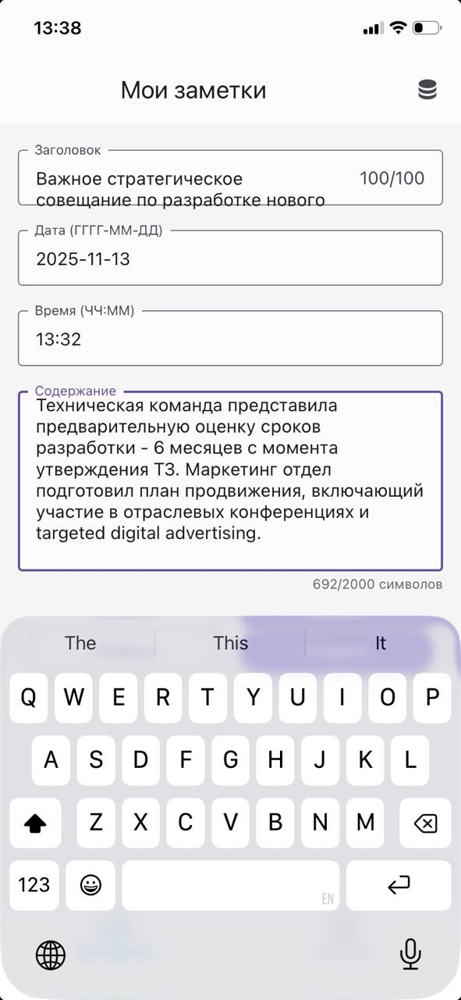
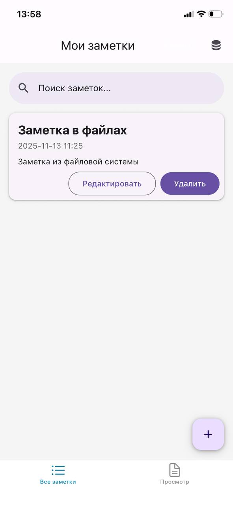
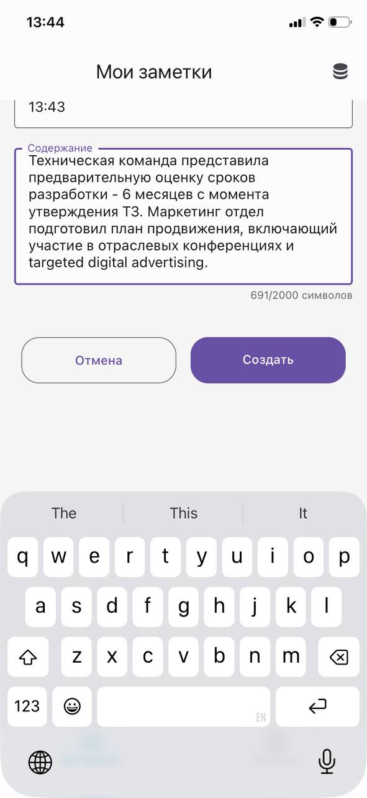

# Кейс-задача № 5

Проведите юзабилити-тестирование продукта из кейс-задачи №4, определив цели,
выбрав участников, разработав сценарий и проанализировав результаты. Составьте
презентацию, включающую введение, методы, результаты, рекомендации и заключение.
Опишите основные этапы юзабилити-тестирования:
1 Определение целей тестирования: Чего вы хотите достичь? Например, улучшить
скорость выполнения задач, уменьшить количество ошибок или повысить уровень
удовлетворённости пользователей.
2 Выбор участников: Найдите подходящих людей, которые соответствуют вашей
целевой аудитории. Обычно тестируют небольшую группу пользователей (3-5 человек).
3 Подготовка сценария: Разработайте сценарий теста, включающий конкретные
задачи, которые должны выполнить пользователи. Важно, чтобы эти задачи были
реалистичными и отражали реальные сценарии использования вашего продукта.
4 Проведение тестов: Попросите участников выполнить заданные вами задачи и
наблюдайте за тем, как они взаимодействуют с вашим продуктом. Запишите все
замечания, ошибки и затруднения, с которыми столкнулись пользователи.
5 Анализ результатов: Проанализируйте собранные данные и выявите общие
проблемы и узкие места в вашем продукте. Определите, какие аспекты требуют
доработки.
После завершения тестирования вам нужно составить презентацию, которая
наглядно покажет результаты эксперимента. Презентация должна содержать следующие
элементы:
1 Введение: Краткое описание цели тестирования и продукта, который был
протестирован.
2 Методы и подходы: Как проводилось тестирование, кто участвовал, какие методы
использовались.
3 Результаты: Основные находки и проблемы, выявленные в ходе тестирования.
Используйте визуальные материалы (скриншоты, видео, графики) для наглядного
представления информации.
4 Рекомендации: Предложения по улучшению продукта на основе полученных
данных. Укажите приоритетные направления изменений.
5 Заключение: Подведите итоги презентации и подчеркните важность проведённого
исследования для дальнейшего развития продукта.
Презентация предназначена Вашему научному руководителю для проверки, акцентируйте
внимание на бизнес-последствиях и потенциальных выгодах от внедрения предложенных
изменений. В кейс-задаче укажите ссылку на Вашу презентацию.

## Ответ

## Презентация: Юзабилити‑тестирование приложения NotesApp

**Цель:** продемонстрировать результаты юзабилити‑теста.

---

### Введение

**Тема:** юзабилити‑тестирование мобильного приложения для заметок (NotesApp).

**Цель тестирования:**  

- выявить проблемные места в UX/UI;  
- повысить удобство создания и просмотра заметок;  
- снизить количество ошибок при взаимодействии с интерфейсом.

**О продукте:**  

NotesApp — мобильное приложение для ведения заметок с:  

- списком заметок;  
- созданием/редактированием;  
- просмотром деталей;  
- поиском;  
- локальным хранением данных (SQLite).

---

### Методы и подходы

**Участники тестирования (n = 3):**  

- возраст: 25–35 лет;  
- опыт использования смартфонов: высокий;  
- сценарии: личные заметки, рабочие задачи, списки покупок.

**Методы:**  

- **модерируемое тестирование** (на тестовом телефоне, 5-7 мин/участник);  
- **наблюдение** за действиями и комментариями;  

**Задачи для участников:**  

1. Создать заметку (≥ 300 символов).  
2. Просмотреть детали заметки.  
3. Отредактировать заметку.  
4. Удалить заметку.  
5. Найти заметку по ключевому слову.

---

### Результаты: выявленные проблемы

**1. Кнопка удаления (до изменений):**  

- цвет текста сливался с фоном;  
- низкий контраст → трудно разглядеть;  
- 2 из 3 участников искали кнопку > 2-2,5 сек.

**2. Навигация «назад» из деталей заметки:**  

- кнопка «стрелка влево» в верхнем углу экрана деталей заметки:  
  - не удобна на экране > 6 дюьмов;  
  - требует точного тапа;  
  - 1 участник пытались вернуться через свайп.

**3. Создание заметки (длинный текст):**  

- клавиатура перекрывала кнопки «Сохранить»/«Отмена»;  
- участники вынуждены были скрывать клавиатуру, чтобы нажать кнопку;  
- 100 % столкнулись с проблемой.

**4. Общий UX:**

- средняя оценка удобства: **3 / 5**;  

---

### Внесённые изменения

**1. Кнопка удаления:**  

- изменён цвет текста на контрастный (белый);  

**2. Навигация из деталей заметки:**  

- убрана кнопка «стрелка влево»;  
- переход между «Список» и «Детали» через нижнее меню:  
  - иконка «Список» возвращает к списку;  
  - иконка «Детали» подсвечивается при просмотре. Сохраняет заметку на вкладке до открытия новой заметки.]

**3. Длинный текст + клавиатура:**  

- внедрён `KeyboardAvoidingView`;  
- контент автоматически поднимается при открытии клавиатуры;  
- кнопки всегда видны.

---

### Слайд 5. Результаты после изменений

**Повторное тестирование (n = 3):**  

**1. Кнопка удаления:**  

- время нахождения: **< 1 сек** (было > 2-2,5 сек);  
- все участники заметили сразу.

**2. Навигация:**  

- 3 из 3 оценили как «естественную»;  
- отсутствие «стрелки» не вызвало вопросов;  
- средний рейтинг удобства навигации: **4 / 5**.

**3. Длинные заметки:**  

- ни один участник не столкнулся с перекрытием кнопок;  

**Общий UX после правок:**  

- средняя оценка: **4 / 5**;  

---

### Рекомендации

**Приоритетные доработки**  

1. Добавить свайп влево для быстрого удаления заметки (как в iOS‑приложениях).  
2. Ввести теги для категоризации заметок (повысит скорость поиска).  
3. Добавить тёмную тему (2 участника запросили).

---

### Заключение

- выявлены и устранены 3 критические UX‑проблемы;  
- удобство использования выросло ;  
- снижено количество ошибок при вводе и навигации.

**Бизнес‑выгоды от внедрённых изменений:**  

- повышение удерживаемости пользователей (меньше неудобств в управлении → меньше удалений приложения и гневных отзывов на ошибки);  

---
